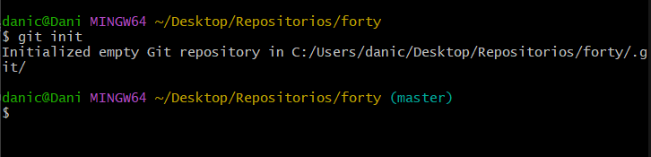

# 01 - Ejercicio de Git - Forty - local y remoto

## 1. Trabajo en local

**1. Inicializa un nuevo repositorio Git en una carpeta llamada “forty” y agrega los archivos proporcionados en el aula virtual.**

```bash
git init
git add .
git commit -m "Añaddimos archivos"
```



**2. Renombra la rama master a main.**

```bash
git branch -m main
```


**3. Haz que los ficheros README.txt , LICENSE.txt y passwords.txt sean ignorados por el control
de versione.**


**4. Crea el archivo passwords.txt . Comprueba que el control de versiones lo ignora.**


**5. Crea una rama llamada "feature-content" . Muévete a esa rama. Cambia, en la línea 3477, el font-size por 1.5em en el archivo main.css . Confirma cambios y haz commit. Muestra los logs de la forma más gráfica posible.**

```bash
git checkout -b feature-content
git add .
git commit -m "Cambio en main.css"

```


**6. Elimina el archivo "passwords.txt" en la carpeta forty . Verifica el estado del repositorio. ¿Hay cambios pendientes?**


No se ve porque esta ignorado por el .gitignore

**7. Crea un nuevo archivo llamado " about.html ", partiendo del archivogeneric.html y agrégalo al repositorio, haz un nuevo commit.**


**8. Cambia a la rama main. Examina los logs del repositorio de forma gráfica.**

```bash
git checkout main
git log --oneline --graph --decorate --all
```


**9. Modifica algo en el archivo generic.html , comprueba que hay cambios, y realiza otro commit. Examina los logs del repositorio de forma gráfica.**


**10. Modifica algo en el fichero elements.html . Confirma los cambios, pero no hagas commit.**


**11.  Mira las diferencias de elements.html . Los cambios no nos gustan, deshaz los cambios de elements.html . Comprueba que no hay cambios pendientes.**


**12. Muestra las diferencias entre dos ramas.**

```bash
git diff main..feature-content
```


**13. Fusiona la rama "feature-content" con la rama principal (main). Muestra los logs del repositorio de una forma gráfica y completa.**

```bash
git merge feature-content
```


**14. Crea una nueva rama llamada " hotfix " y en ella, corrige un error crítico en el archivo " index.html ". (Por ejemplo, añade el enlace a la nueva página about.html).**


**15. Fusiona la rama "hotfix" con la rama principal y verifica el historial de commits de forma que se vean todas las ramas gráficamente. ¿Borrarías la rama hotfix ? ¿En qué caso? ¿Cómo?**

```bash
git merge hotfix
```


**16. Muestra el historial de cambios limitado a los últimos 3 commits.**

```bash
git log -3
```

**17. Etiqueta el commit actual como "v1.0" y muestra las etiquetas existentes.**


## 2. Trabajo en remoto

**1. Sube al remoto los ficheros de tu repositorio local.**

```bash
git remote add origin https://github.com/Danieldm115/forty.git
git push origin main
```


**2. En local, crea una rama 'feature-head'. Cambia el título en la sección head de index.html , borra los comentarios del head , o previos, también. Confirma y sube los cambios al remoto.**

```bash
git add .
git commit -m “Cambio el header”
git push origin feature-header
```


**3. En remoto, crea una rama 'feature-articulo'. Duplica la página generic , nómbrala como articulo.html, y añade como contenido un artículo sobre Git. Confirma los cambios y realiza un commit. Muestra los commits del repositorio tal como se ven en GitHub.**


**4. En el repositorio local examina los cambios. Actualiza el repositorio con el remoto. Fusiona en 'main' las dos ramas 'feature'. Crea la etiqueta 'v2.0'. Muestra los logs, commits, etiquetas y ramas actuales, en local y en remoto.**


**5. Muestra los logs de forma que se vean las ramas en tu copia local.**


**6. Sube los cambios al remoto borrando la rama nueva , si es necesario. Comprueba primero con un comando en local, las ramas que hay en el repositorio remoto.**


7. **Muestra en local los cambios en el archivo index.html entre la versión actual y la anterior.**

```bash
git diff HEAD~1 index.html
```

