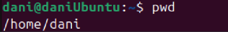

# REPASO DE LINUX

## Capítulo 2:

### 1. Comandos utilizados:

### Visualización, creación y cambios de directorios

- `pwd`: Muestra el directorio actual
    
    ```bash
    $ pwd
    ```
    



- `ls`: Lista ficheros y directorios
`ls` no muestra archivos ocultos pero se le pueden añadir modificadores:
    - `ls -a`: muestra todos los archivos, incluyendo los ocultos (cuyo nombre comienza por un punto)
    - `ls -l`: muestra un listado detallado, con la última fecha de modificación de cada archivo, el tamaño, etc.
    - `ls -h`: muestra el tamaño de los ficheros en bytes, Kb, Mb, etc.
    - `ls -s`: muestra el tamaño de cada fichero, en bloque
- `cd`: Cambia de directorio
    
    Hay dos tipos de rutas:
    
    - **Absoluta:** Una ruta es absoluta cuando empieza por `/`. Esto significa que la ruta parte desde la base del orden de carpetas del sistema.
    - **Relativa:** Una ruta es relativa cuando empieza por cualquier otro carácter. Esto significa que el punto de origen es el directorio que se muestra. `..`: Volver al nivel anterior.
- `mkdir`: Crea uno o varios directorios
    
    ```bash
    $ mkdir nombreCarpeta
    ```
    

### Visualización de ficheros

- `cat`: Visualiza un fichero
- `more`: Visualiza un fichero pantalla a pantalla
- `less`: Visualiza un fichero pantalla a pantalla y permite retroceder
- `head`: Visualiza las primeras filas de un fichero
- `tail`: Visualiza las ultimas filas de un fichero

### Edición de ficheros

- `touch`: Crea un fichero vacío
- `vi`: Editor de textos muy potente
- `ee`: Editor de textos muy simple
- `mcedit`: Editor de textos que forma parte de Midlsnight Commander

### Comandos de sistema

- `apt-get`: Instala y desinstala programas
- `man`: Muestra ayuda sobre un determinado comando

### 2. Estructura de directorios


### 3. Ejercicios del capítulo 2

1. ¿En qué directorio se encuentran los ficheros de configuración del sistema?
    
    En el directorio etc
    
    
    

1. Para entrar en un sistema Linux hace falta
    1. nombre de usuario, contraseña y dirección IP
    
    **b) nombre de usuario y contraseña**
    
    1. únicamente una contraseña.
2. Muestra el contenido del directorio actual.
    
    ```bash
    ls
    ```
    
    
    
3. Muestra el contenido del directorio que está justo a un nivel superior.

```bash
ls ..
```


1. En qué día de la semana naciste?, utiliza la instrucción cal para averiguarlo.
    
    ```bash
    cal mayo 2004
    ```
    
    
    
2. Muestra los archivos del directorio /bin

```bash
ls /bin
```


1. Suponiendo que te encuentras en tu directorio personal (/home/nombre), muestra un listado del contenido de /usr/bin
2. con una sola línea de comando

```bash
ls /usr/bin
```

1. moviéndote paso a paso por los directorios

```bash
cd ..
cd ..
cd usr
cd bin
ls
```


1. con dos líneas de comandos.

```bash
cd /usr/bin
ls
```


1. Muestra todos los archivos que hay en /etc y todos los que hay dentro de cada subdirectorio, de forma recursiva (con un solo comando).

```bash
ls -R /etc
```


1. Muestra todos los archivos del directorio /usr/bin ordenados por tamaño (de mayor a menor). Sólo debe aparecer el nombre de cada fichero, sin ninguna otra información adicional.

```bash
ls -S /usr/bin
```


1. Muestra todos los archivos del directorio /etc ordenados por tamaño (de mayor a menor) junto con el resto de características, es decir, permisos, tamaño, fechas de la última modificación, etc. El tamaño de cada fichero debe aparecer en un formato “legible”, o sea, expresado en Kb, Mb, etc.

```bash
ls -Slh /etc
```


1. Muestra todos los archivos del directorio /bin ordenados por tamaño (de menor a mayor). Sólo debe aparecer el tamaño y el nombre de cada fichero, sin ninguna otra información adicional. El tamaño de cada fichero debe aparecer en un formato “legible”, o sea, expresado en Kb, Mb, etc.

```bash
ls -Sshr /bin
```


1. Muestra el contenido del directorio raíz utilizando como argumento de ls una ruta absoluta.

```bash
ls /
```


1. Muestra el contenido del directorio raíz utilizando como argumento de ls una ruta relativa. Suponemos que el directorio actual es /home/elena/documentos.
2. Crea el directorio gastos dentro del directorio personal.
3. ¿Qué sucede si se intenta crear un directorio dentro de /etc?
4. Muestra el contenido del fichero /etc/fstab .
5. Muestra las 10 primeras líneas del fichero /etc/bash.bashrc
6. Crea la siguiente estructura de directorios dentro del directorio de trabajo personal:


1. Crea un fichero vacío dentro del directorio musica, con nombre estilos_favoritos.txt
2. Utiliza tu editor preferido para abrir el fichero estilos_favoritos.txt e introduce los estilos de música que más te gusten. Guarda los cambios y sal.
3. Muestra todo el contenido de estilos_favoritos.txt
4. Muestra las 3 primeras líneas de estilos_favoritos.txt
5. Muestra la última línea de estilos_favoritos.txt
6. Muestra todo el contenido del fichero estilos_favoritos.txt excepto la primera línea. Se supone que no sabemos de antemano el número de líneas del fichero.